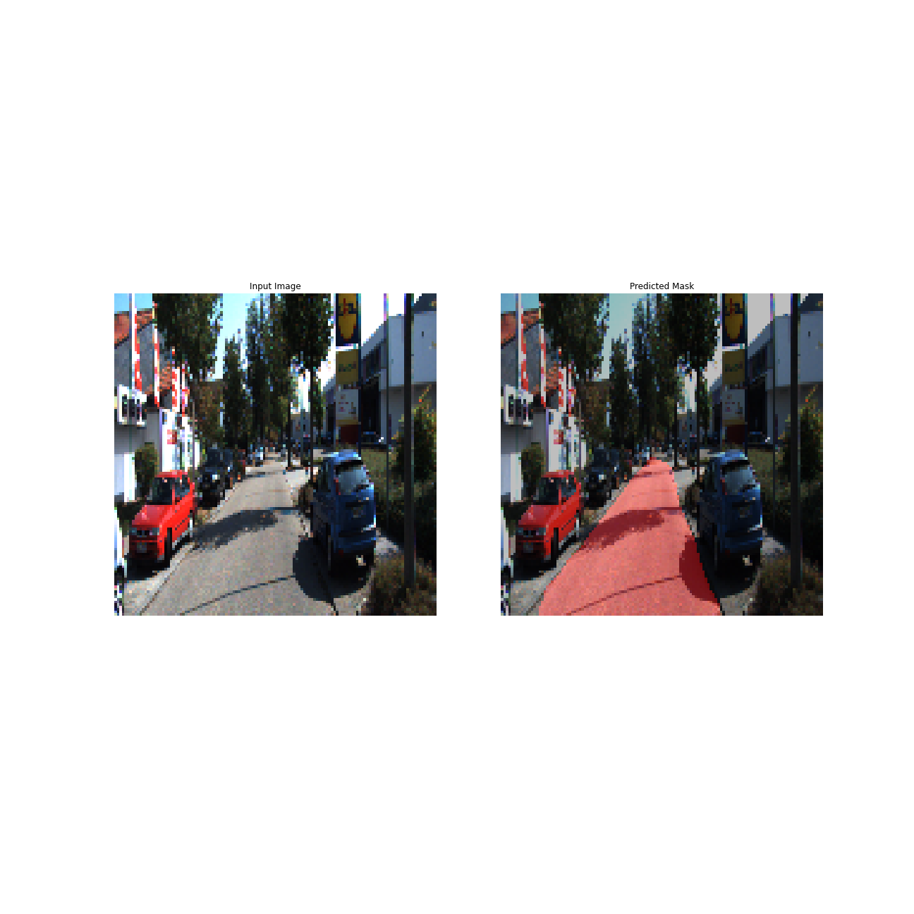
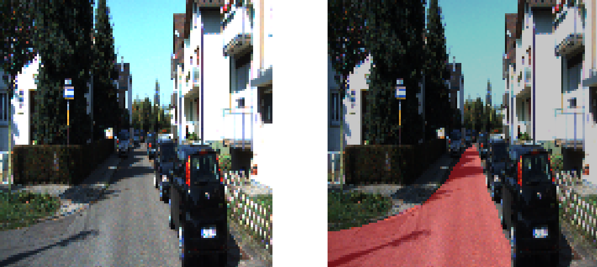
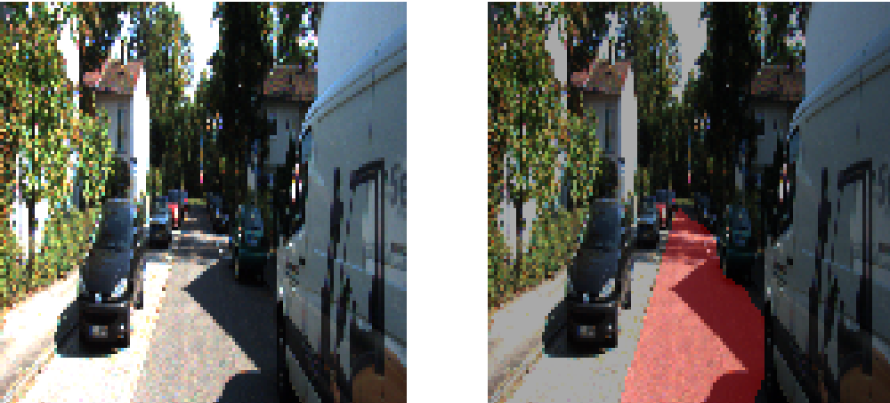

# 🚗 Lane & Road Segmentation using FCN-8 (VGG-16 Encoder)

This project implements **lane/road segmentation** using a **Fully Convolutional Network (FCN-8)** built on top of a **VGG-16 encoder**.  
The model is trained on the **KITTI Road Segmentation Dataset** and produces pixel-wise binary masks identifying drivable road areas.

## 📷 Example Prediction 

```markdown



---

## 📌 Project Overview

Semantic segmentation identifies **which pixels belong to the road**.  
This project uses:

- **VGG-16** (pretrained on ImageNet) as the encoder  
- **FCN-8 decoder** with **skip connections**  
- **Concatenate-based fusion** to combine multi-scale features  
- **Bilinear upsampling** instead of transposed convolutions  
- **Binary cross-entropy loss**, **Mean IoU** metric  
- Full train → validation → test pipelines in TensorFlow

---

## 🗂 Dataset

KITTI Road Dataset (image + mask pairs)  
- Images resized to **128×128** for stable downsampling  
- Masks converted to binary:  
  - **1 = road**  
  - **0 = non-road**

> 📌 As shown in the dataset section , preprocessing includes resizing, normalization, and optional flips.

---

## 🧠 Why 128×128 Input Size?

As explained in the notebook  VGG-16 downsamples the image **five times** using MaxPooling2D (÷2 each time): 128 → 64 → 32 → 16 → 8 → 4

All values remain whole numbers → crucial for clean upsampling in a decoder.

---

## 🧱 Model Architecture

### **1. Encoder – Pretrained VGG-16**

We extract three feature maps:

| Encoder Layer        | Scale       | Purpose |
|----------------------|-------------|---------|
| `block5_pool`        | 1/32        | High-level semantics |
| `block4_pool`        | 1/16        | Mid-level structure |
| `block3_pool`        | 1/8         | Boundary details |


---

## 🔄 Decoder Approach: Upsampling + Concatenate (FCN-8)

The decoder progressively reconstructs the segmentation mask using three stages:

### **Why Concatenate? (Final Choice)**

 **Concatenate Technqie was finally selected** because it yeilded the best results and:

1. **Preserves full feature information**  
   Skip features are not added or averaged — they are fully retained.

2. **Improves boundary accuracy**  
   Especially important for lane edges.

3. **More flexible than Add()**  
   `Add` requires identical channels; `Concatenate` does not.

4. **Matches the FCN-8 design**  
   FCN-8 combines multi-scale features from  
   `block5 → block4 → block3`.

5. **Reduces over-smoothing**  
   Better gradient flow from early layers.


---

## 🏗️ FCN-8 Decoder Structure
Upsampling uses **bilinear interpolation** (smooth, checkerboard-free).

---

## 🧪 Training Setup

- **Loss:** `BinaryCrossentropy`
- **Optimizer:** `Adam()`
- **Metric:** `MeanIoU`
- **Callbacks:**  
  - TensorBoard  
  - Early Stopping  
  - ModelCheckpoint  
  - Live prediction display callback

---

## 📦 Data Pipeline

### Training Pipeline  
- Resize → 128×128  
- Random horizontal flip  
- Normalize image  
- Shuffle → Batch (32) → Repeat → Prefetch

### Validation Pipeline  
- Resize + Normalize  
- No augmentation  
- Deterministic

### Test Pipeline  
- Single pass, no augmentation  
- Batch + prefetch

---

## 📊 Prediction & Visualization

Two visualization modes:

### **1. Image-wise Output**
Shows:
- Input image  
- Predicted mask overlay (pink)  

### **2. Video Output**
On each frame:
- Resize  
- Predict mask  
- Weighted overlay  
- Write to output video  


